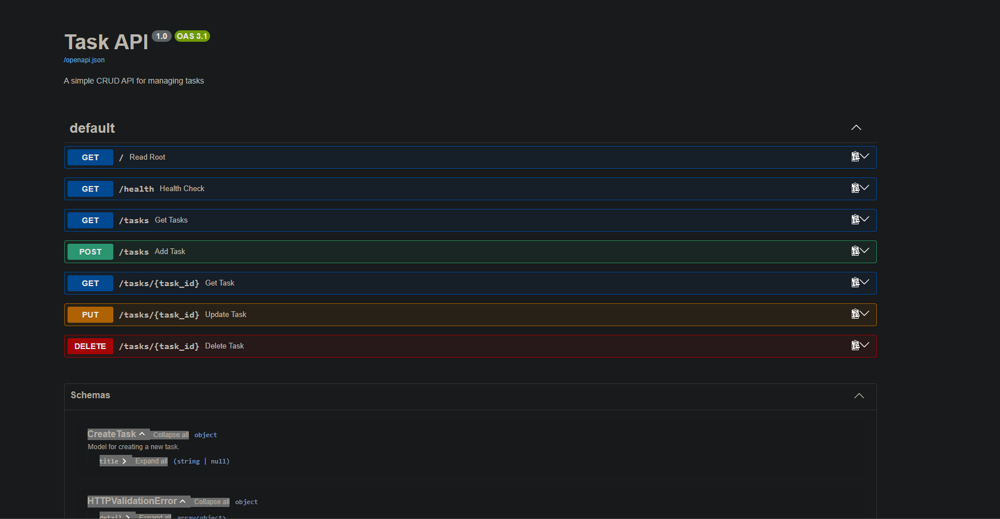

# 📋 Task API – A Simple CRUD API

A minimal **FastAPI** application that manages a to‑do list.  
It supports full **CRUD** operations – **C**reate, **R**ead, **U**pdate, and **D**elete

---

## ✨ Features

- List all tasks  
- Get a single task by ID  
- Create a new task 
- Update an existing task
- Delete a task  

---

## 🚀 Installation & Running

Steps to get the API up and running:

```powershell
# 1. Clone the repository (or download the code)
git clone https://github.com/yourusername/task-api.git
cd task-api

# 2. Create and activate a virtual environment (Windows PowerShell)
python -m venv venv
.\venv\Scripts\Activate

# 3. Install dependencies
pip install fastapi uvicorn

# 4. Start the server
uvicorn main:app --reload --port 8000
```

**In the browser**  
- API root: [http://localhost:8000/](http://localhost:8000/)  
- Swagger UI: [http://localhost:8000/docs](http://localhost:8000/docs)


---

## 📡 API Endpoints

| Method | Endpoint           | Description                         | Status Codes               |
|--------|--------------------|-------------------------------------|----------------------------|
| GET    | `/`                | API information                     | 200                        |
| GET    | `/health`          | Health check                        | 200                        |
| GET    | `/tasks`           | Get all tasks                       | 200                        |
| GET    | `/tasks/{id}`      | Get a single task by ID             | 200, 404                   |
| POST   | `/tasks`           | Create a new task                   | 201, 400                   |
| PUT    | `/tasks/{id}`      | Update a task (title and/or done)   | 200, 400, 404              |
| DELETE | `/tasks/{id}`      | Delete a task                       | 204, 404                   |

---

## 🧪 Example `curl -i` Output

Below is a quick test sequence using `curl`.

**1. List all tasks**  
```bash
curl -i http://localhost:8000/tasks
```

**Response**:
```
HTTP/1.1 200 OK
date: Wed, 02 Sep 2026 13:23:48 GMT
server: uvicorn
content-length: 145
content-type: application/json

[{"id":1,"title":"Finish CRUD project","done":false},
{"id":2,"title":"Play the piano","done":true},
{"id":3,"title":"Go for a walk","done":false}]
```


## 🖼️ Swagger UI Screenshot

Here is the interactive API documentation served at `/docs`:



